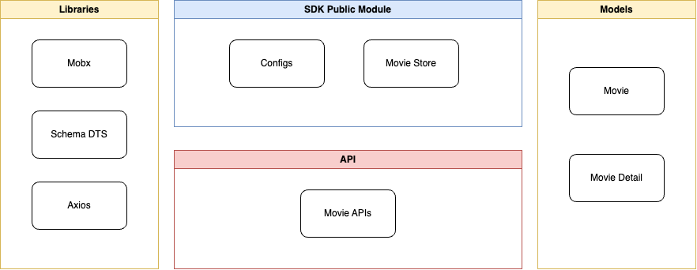

# Movie SDK

## Introduction

Mini movie SDK, provide the functions to search movie and get movie detail

This is a project to study and test out building a TypeScript node package that supports Node and React Native

## Features

+ Config SDK
+ Search movie
+ Get movie detail
+ MovieStore state with Mobx observable properties
+ Movie and Movie Detail models

Example with Node App
```ts
import {NMovieSDK, NmSDKConfigs, MovieStore } from "n-movie-sdk";

async function main() {
    NMovieSDK.config({
        api_key: null,
        randomMovieKeywords: ["inside out"],
        movieStoreObservable: true
    })
    const ms = new MovieStore();
    await ms.fetchMovies();
    console.log(ms.movies);
}

main();
```

This package is built to support CommonJS and ES modules. Therefore React Native application and any Node applications, modules can integrate.

## Architecture



## Development

### I. Development IDE and Environment setup
1. Install Android Studio
2. Install NDK and CMake in Android Studio 
3. Install Java 17
4. Install Node.js - This application is developed with Node.JS v20
5. Setup React Native environment - This application is developed with React Native v0.74
   
    Follow this link [React Native - Setup Environment](https://reactnative.dev/docs/environment-setup)

1. Install ```yarn``` (**Optional**)
2. Install XCode
3. Install Visual Studio Code or any JavaScript editor
   
    Follow this link to setup VS Code [VS Code React Native - Setup Environment](https://marketplace.visualstudio.com/items?itemName=msjsdiag.vscode-react-native)

### II. Run project
1. Open the project in terminal
2. Run this cmd to install dependencies
```bash
npm install
```
or
```bash
yarn install
```
3. Build the project with this command
```bash
yarn build
```

## License
MIT